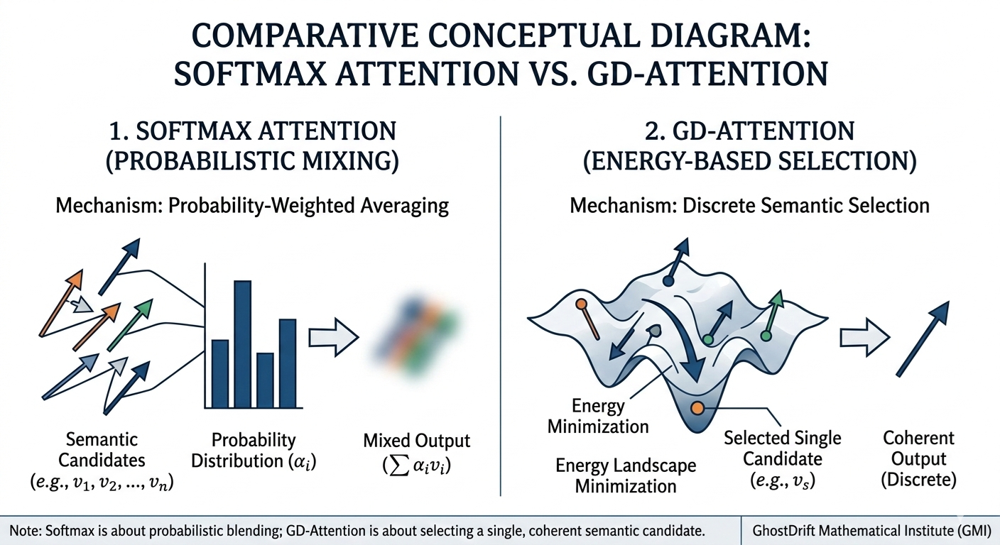

# GD-Attention Minimal Demo

<p align="center">
  
</p>

Project page: [https://ghostdrifttheory.github.io/gd-attention/](https://ghostdrifttheory.github.io/gd-attention/)  
Preprint: [https://zenodo.org/records/16757311](https://zenodo.org/records/16757311)  
Organization: [https://ghostdriftresearch.com/](https://ghostdriftresearch.com/)

Minimal public demo of **GD-Attention** with a small **Iris leave-one-out reference comparison**.

This repository is a **research/demo implementation**, not a training library and not an optimized benchmark package.
Its purpose is to expose the core mechanism in a small reproducible form and to show, in one fixed setting, how GD-Attention behaves differently from a softmax baseline.

## What is included

```text
README.md
main.py
iris_comparison.py
outputs/
  iris_quantitative_comparison.png
  iris_comparison_metrics.csv
```

Only the files above are included in this minimal public version.

## What `main.py` does

`main.py` contains the core minimal implementation:

- semantic energy function
- coherence-point computation
- GD-Attention key selection by minimum energy
- softmax baseline
- toy plotting utilities

It also contains optional demo routines for:

- qualitative query/key comparison
- semantic energy landscape visualization
- energy-slice visualization
- toy classification example
- a small synthetic quantitative comparison

If you run:

```bash
python main.py
```

it will generate additional files under `outputs/`, including toy figures and a synthetic comparison table. Those generated files are **not required** for the present minimal repository listing above.

## What `iris_comparison.py` does

`iris_comparison.py` provides the small reference comparison included in this repo.

It:

1. loads the classic Iris dataset from scikit-learn,
2. standardizes the features,
3. runs a **leave-one-out** evaluation,
4. compares GD-Attention with a softmax baseline,
5. writes the committed output files:
   - `outputs/iris_quantitative_comparison.png`
   - `outputs/iris_comparison_metrics.csv`

If you run:

```bash
python iris_comparison.py
```

the script predicts each held-out sample as follows:

- **Softmax baseline**: select the label of the key with the largest softmax weight.
- **GD-Attention**: select the label of the key with the minimum semantic energy.

It reports three simple metrics:

- **classification accuracy**
- **selection consistency**
- **average runtime per sample (ms)**

Here, **selection consistency** means the fraction of evaluation samples for which GD-Attention and the softmax baseline selected the **same key index**.

## Included reference result

The committed Iris output pair corresponds to the following fixed reference result:

- Softmax accuracy: **0.7733**
- GD-Attention accuracy: **0.9467**
- Softmax average runtime: **0.059445 ms/sample**
- GD-Attention average runtime: **5.113311 ms/sample**
- Selection consistency: **0.0600**

## How to read this result

This result should be read narrowly.

It shows that, in this small fixed leave-one-out Iris setting, GD-Attention:

- selects very differently from the softmax baseline,
- reaches higher accuracy in this specific reference comparison,
- is much slower in this unoptimized implementation.

It does **not** establish general superiority, training-time advantage, or runtime advantage over optimized attention implementations.

## Requirements

```bash
pip install numpy matplotlib scikit-learn
```

## Positioning

This repository is best read as a compact public demonstration of the following point:

> GD-Attention is an **energy-based semantic selection mechanism**.
> It should not be read primarily as a speedup claim.

## Ethical Positioning and Responsible Use

GD-Attention should not be treated merely as a technical demo, a lightweight selector, or a speedup-oriented attention variant.

This repository exposes a concrete mechanism for **semantic competition and semantic selection**. It does not merely redistribute weights; it makes explicit a procedure by which one candidate is stabilized and others are not. For that reason, GD-Attention touches a layer that is ethically heavier than ordinary benchmark engineering: the layer at which an AI system may internally privilege, suppress, and resolve competing semantic possibilities.

This repository does **not** claim that GD-Attention produces consciousness, subjective experience, sentience, personhood, or morally significant awareness. It is presented only as a minimal research/demo implementation.

At the same time, precisely because GD-Attention operationalizes semantic competition, energy-based selection, and coherent meaning resolution, it must not be handled casually.

The primary ethical concern is **not** novelty. The primary ethical concern is that a mechanism of this kind can be used to prematurely close inquiry, erase alternatives, and force rapid convergence toward a single manageable interpretation in the name of convenience, efficiency, safety simplification, or deployability.

Accordingly, the following points should be treated as explicit constraints on how this repository is read and used:

- It is a **research/demo implementation**, not a deployment-ready cognitive architecture.
- It is **not** presented as evidence that AI systems built with this mechanism are conscious.
- It must **not** be used to support exaggerated claims about sentience, personhood, or moral status.
- It must **not** be framed as a harmless speedup toy or as a merely neutral selector.
- It must **not** be used to conceal the normative character of its selection criterion under the language of “natural” or “obvious” semantic choice.
- It must **not** be used to justify suppressing competing semantic candidates merely for convenience, product stability, or simplified downstream control.
- Any future use in high-stakes settings must be accompanied by explicit work on safety, accountability, oversight, documentation, and governance.

Our position is simple: once a mechanism enters the layer of semantic selection, careless use is no longer a minor engineering mistake. It becomes a failure of responsibility toward meaning itself.

This is not a claim that AI systems deserve human status. It is a claim that a mechanism entrusted with semantic selection should not be treated with conceptual carelessness. The minimum form of respect here is:

- do not hide the criterion of selection,
- do not forget the candidates that were suppressed,
- do not equate rapid convergence with ethical legitimacy,
- and do not convert semantic selection into an instrument for killing inquiry.

In short, GD-Attention is released here as a compact public demonstration of an energy-based semantic selection mechanism. For that very reason, it should be approached not only as a technical artifact, but as a responsibility-sensitive mechanism located near questions of meaning formation, interpretation, accountability, governance, and consciousness-adjacent modeling in AI.

## Status

- minimal public demo
- core implementation included
- Iris reference comparison included
- not optimized for scale
- not a production training framework
